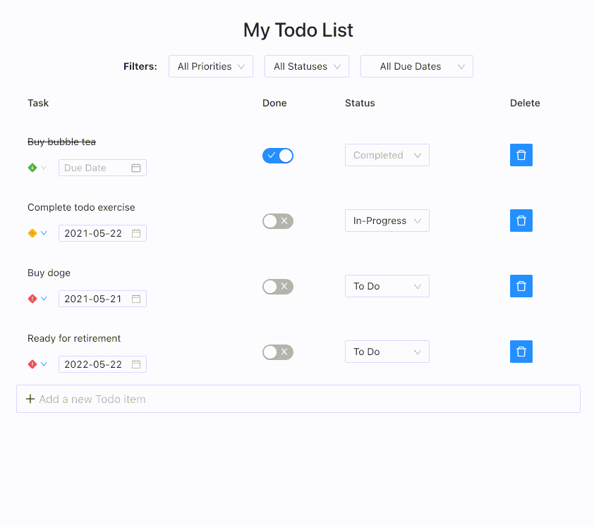

# My Todo List
Yet another todo list application. ✔️✔️✔️



### Development Setup
Install dependencies:
```
npm install
```
Build (and bootstrap) the project:
```
npm run build
```
Start the development server:
```
npm start
```
This will start both the frontend and API server on port `3000` and `3001` respectively.

Open `http://localhost:3000` in browser.
